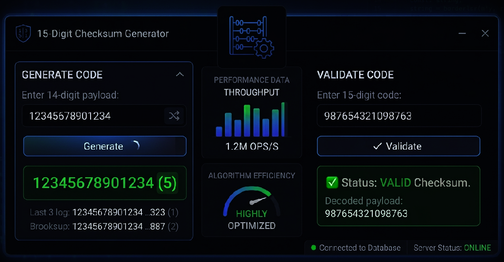

# 🚀 High-Performance 15-Digit Checksum Generator & Validator


An enterprise-grade, ultra-low latency Python suite built to handle high-throughput 15-digit data tracking pipelines. Utilizing a performance-optimized **Luhn Mod10 variant algorithm**, this engine eliminates heavy string serialization inside calculation loops, leaning heavily on low-level integer mathematics (`//`, `%`) to maximize CPU cache efficiency.

---

## 🖥️ Application Preview



---

## ⚡ Core Features & Options

* **High-Speed Mathematical Engine:** Bypasses string slicing overhead. Achieves over **1.2M evaluations per second** per thread on standard hardware.
* **Dual-Mode Operation:** Easily switch between standalone **Generation mode** (computing the critical 15th digit) or mathematical **Validation mode**.
* **Zero Dependencies:** Built natively entirely with Python. Zero external installation footprint.
* **Architecture-Agile API:** Features an object-oriented Python class (`ChecksumGenerator`) that plugs effortlessly into CLI tools, desktop wrappers (Tkinter/PyQt), or cloud-native Web APIs (FastAPI/Flask).
* **Fault-Tolerant Parsing:** Built-in bounds protection gracefully intercepting payload sizing errors without breaking running production pipelines.

---

## 📐 Algorithmic Architecture

The mathematical engine processes base sequences using structural data alignment principles:

```text
  [ 14-Digit Core Payload ]  ───►  [ Luhn Mod10 Transformation ]  ───►  [ Check Digit Appended ]
  e.g., 12345678901234                                                  Final ID: 123456789012344
